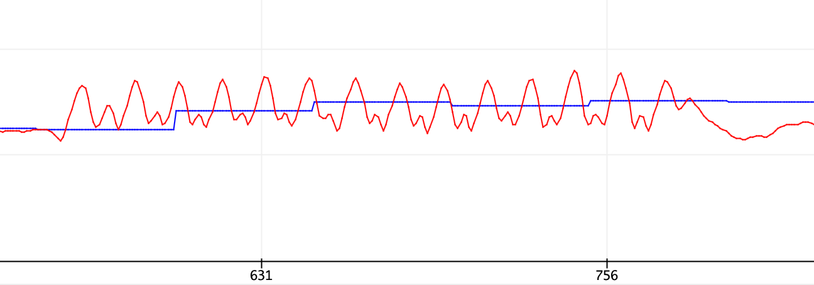

## Lab Assignment 3: Simple Pedometer

### Introduction
Lab3 is a continuation of the previous lab2 in which you are going to implement a simple pedometer to count steps. Skeleton code can be found at [Github](https://github.com/HKUST-ISD/Lab3_template).  

> A pedometer is a device, usually portable and electronic or electromechanical, that counts each step a person takes by detecting the motion of the person's hands or hips.

### Task 0 – Configure accelerometer, write helper function and calculate the norm

In Lab 2, the sampling rate is configured to be **6.66kHz**. It is far beyond the natural frequency of walking or even running. In Lab 3, it is better to use a lower sampling rate together with a low pass filter to reduce unexpected noise. 

- TODO:  Set the Accelerometer control register to work at **104 Hz**, 4G and default Anti-aliasing filter.
- TODO:  Write `dataAccAvailable` to check whether a new sample of accelerations is available 
- TODO:  Read the latest acceleration data from the imu and store the norm into `normAcc`. Once you finish, try to plot `normAcc` to see whether the code is correct.

### Task 1 – Implement dynamic threshold
The system continuously updates the maximum and minimum values of the norm of acceleration every `UPDATE_AFTER_SAMPLE` samples. The average value, `(minAcc + maxAcc)/2`, is called the dynamic threshold level.

- TODO:  Implement dynamic threshold and store the threshold into `dynamicThreshold`
The result should look similar to 

### Task 2 – Implement dynamic precision

Anytime `dynamicThreshold` is updated, `dynamicPrecision` should be updated accordingly as well. `dynamicPrecision` equals to `DYNAMIC_PRECISION_COEFF * (maxAcc - minAcc)` and it is a quantity that represents how much change is considered to be meaningful. If it is too small, the detection will suffer from noise. If it is too big, some crucial sample will be dropped.

> A linear-shift-register and the dynamic threshold are used to decide whether an effective step has been taken. The linear- shift-register contains two registers, a sample_new register and a sample_old register. The data in these are called sample_new and sample_old, respectively. When a new data sample comes, sample_new is shifted to the sample_old register unconditionally. However, whether the sample_result will be shifted into the sample_new register depends on a condition: If the changes in acceleration are greater than a predefined precision, the newest sample result, sample_result, is shifted to the sample_new register; otherwise the sample_new register will remain unchanged. The shift register group can thus remove the high-frequency noise and make the decision more precise.

- TODO:  Implement dynamic precision and store it into `dynamicPrecision`
> :warning: Please ensure the dynamic precision is larger than some predefined threshold. It will help to reduce the unexpected counts when the accelerometer is still.

### Task 3 – Count steps

A step is defined as happening if there is a negative slope of the acceleration plot (sample_new < sample_old) when the acceleration curve crosses below the dynamic threshold.

- TODO:  Count steps

### Task 4 – Time constraints
Time constraints is used to discard the invalid vibrations. For this task, you only need to constrain the minimum time required between two successive steps. `timeElapsed` is defined as `current_time - lastCountTime`. If one step is detected but `timeElapsed < <min_time_constraint>`,  it will be discard.
- TODO:  Implement time constraints

### Bonus task- Configure built-in Low Pass Filter
> A low-pass filter (LPF) is a filter that passes signals with a frequency lower than a selected cutoff frequency and attenuates signals with frequencies higher than the cutoff frequency.

As mentioned earlier, the sampling rate of accelerometer is far beyond the natural frequency of walking. We can make use of this property and make the detection more robust.
> :warning: Please do check Figure 6 before configuring the registers.

- TODO: Configure `CTRL8_XL` and `CTRL10_C` to setup low pass filter with cutoff frequency to be `ODR_XL/9`.
- TODO: Configure `CTRL8_XL` and `CTRL10_C` to setup low pass filter with cutoff frequency to be `ODR_XL/50` and compare the result with the previous one (You can simply shake the Arduino with your greatest strength and inspect the plot of `normAcc`).

According to your understanding, which graph corresponds to which cutoff frequency?

